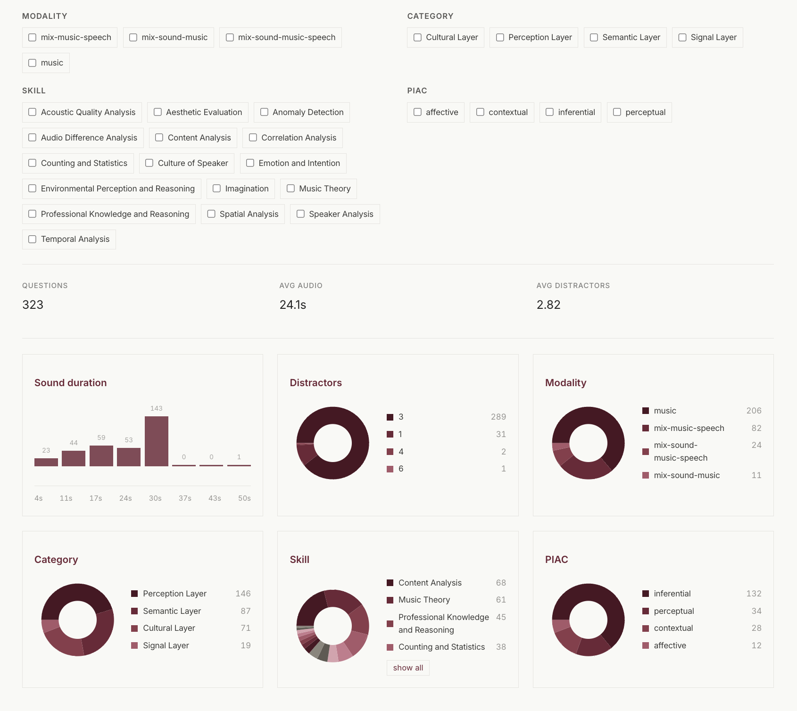

# Welcome to the official repository toward Artificial Musical Intelligence

This repository is designed to be a continuously-updated resource for training Audio-Language models or multimodal models that listen to audio and to let researchers collectively and organically define what Artificial Musical Intelligence should look like. Feel free to fork the repository to add benchmarks, models, or scores. 

## Interactive Benchmark Explorer

The website includes an inspectable benchmark view for browsing the questions
behind each dataset. Researchers can filter a benchmark by modality, category,
skill, and PIAC label, then immediately see the filtered question count, average
audio duration, and average number of distractors. The same view summarizes the
filtered subset with compact visual diagnostics: a sound-duration histogram and
pie charts for distractors, modality, category, skill, and PIAC distribution.
Long category legends stay compact with a `show all` control.

Benchmark audio is stored once under `data/audio/<benchmark>/` and reused by the
website. For local inspection, `docs/audio/` can contain ignored links/copies in
the same organized layout. For the published website, build the question JSON
with `AMI_AUDIO_BASE_URL` set to a static audio host that mirrors `data/audio`;
the generated cards then play those hosted clips directly without committing the
multi-gigabyte audio corpus to git.

Screenshots of these website states live in `data/screenshots/` as visual
references for the site functionality.
